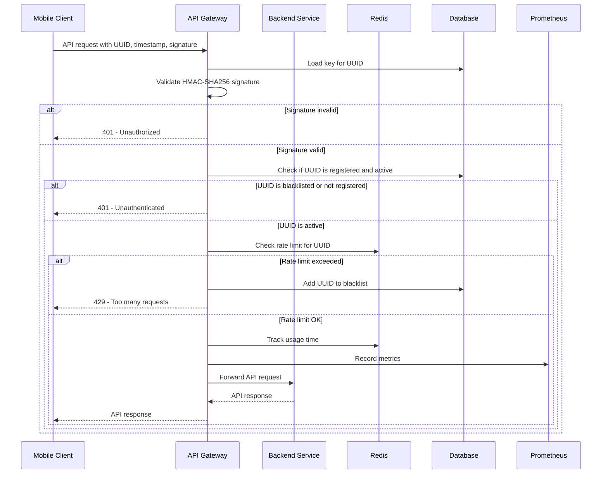

### Instructions for the project
-General description: How the program is used and to what purpose and description of user interface especially form those parts that are not self-evident.
-Structure of the program
-Secure programming solutions: How and in which parts of the code? You should also comment the code itself. You should use a checklist, for example OWASP TOP 10 or SANS 25. Describe how issues have been solved.
-You should include at least manual security testing, but it is highly recommended to do more extensive testing. Report testing and also what you found and what you fixed based on testing. If you made the DevSecOps exercise it is a good idea to use the pipeline throughout the programming project.
-In case something was not yet implemented, document that as well.
-If you know there is security issue or vulnerability, document that as well.
-Suggestions for improvement, what could be implemented.


# Secure Programming Coursework
This is a project for the Secure Programming course at the University of Tampere. 
The goal of this project was to create a secure API gateway that communicates 
with a backend service. The scope was to focus on rate limiting, monitoring and finding a way 
to provide public endpoints for mobile clients - in a way that login action
is not needed but so that clients can be blacklisted if needed. 
The project was implemented using Java and Spring Boot, with a focus on 
security best practices and principles.

Scope was created with the primary goal of exploring new advancements 
in gateway security features.

[](https://drive.google.com/file/d/1MpPrrzv1KVRygbOIFwB32HfT_q0wso6s/view?usp=sharing)

### Parts
- API Gateway: The main entry point for clients to access the backend service. It handles identifying clients, black listing, white listing, rate limiting, and monitoring.
Monitoring has a dashboard in Grafana for unauthenticated and too many requests errors as well as
unusual usage times per client. Metrics are collected using Prometheus. 
- Backend Service: The service that the API Gateway communicates with. It handles the actual business logic and data processing. This is just a dummy service for testing purposes.
- Common Library: A shared library that contains common code used by both the API Gateway and the backend service. This includes utility functions, data models, and security-related code.
- Docker Compose: A configuration file for Docker Compose that defines the services, networks, and volumes used in the project. This allows for easy deployment and management of the services.
- Grafana and Prometheus: Monitoring tools used to visualize and analyze the performance of the API Gateway and backend service. Grafana is used for creating dashboards and visualizations, while Prometheus is used for collecting and storing metrics.
- Postman: A tool used for testing and interacting with the API. It allows easy manual testing of endpoints, sending requests, and viewing responses. Postman collections are included in the project.
- Unit Tests: A set of unit tests for the API Gateway and backend service. These tests cover various aspects of the code, including security and functionality. The tests are run using JUnit and Mockito.
- Integration Tests: A set of integration tests for the API Gateway and backend service. These tests cover the interaction between the two services, ensuring that they work together as expected. The tests are run using Spring Boot Test and Mockito.
- Security Testing: A set of security tests for the API Gateway. The tests are run using OWASP ZAP and CodeQL static application security testing.



## API Gateway
Gateway is the main entry point for clients to access the backend service. The API Gateway is implemented using Spring Boot and Java.
It is a Spring Cloud Gateway project. Routing for endpoints is implemented in GatewayConfig, there are endpoints for public usage and for admin usage. Rate limiting
is implemented using Redis and Spring Cloud Gateway's built-in rate limiting features. Endpoints created for mobile client use the mobile client UUID for rate limiting, to count
requests per client and admin endpoints use ip-address. If there is too many requests coming from mobile client, the client
will be set to the black list and cannot make any more calls, before admin has activated it again. Mobile clients are registered using a registration endpoint, that is called by the mobile client, where POST request
is expected to contain a 16 digits long UUID and a base64 encoded 32-byte key. UUID and key are saved to the database, key is saved as encrypted using AES encryption,
and the authenticity of the later requests is verified using HMAC-SHA256 signing: requests must contain the UUID, a timestamp, and a signature in the header. The signature is generated by concatenating the UUID and timestamp with a colon, 
and then signing it using HMAC-SHA256 with the shared secret key. Requests that do not contain the correct signature and the UUID is not an active device are rejected.

The API Gateway also includes monitoring and logging features, which are implemented using Micrometer and Prometheus. Request and responses are logged, without sensitive data, 
and metrics are collected and sent to Prometheus for monitoring. There is also a UsageTimeTrackingFilter to track the time for each request and response so
that requests coming on unusual times can be detected. There is also a Grafana dashboard included in the project for visualizing the security metrics of the API Gateway.

## How to run the project

### Clone the repository

### Install Docker and Docker Compose

### Add values to .env file, for example:
```
DB_HOST=db
DB_PORT=5432
DB_NAME=product-db
DB_USERNAME=myuser
DB_PASSWORD=mypassword
REDIS_PASSWORD=mypassword
REDIS_HOST=redis
REDIS_PORT=6379
ENCRYPTION_KEY=readFromBelow
GF_SECURITY_ADMIN_USER=admin
GF_SECURITY_ADMIN_PASSWORD=admin
```

Encryption key is used for AES encryption and decryption of the secret key. It should be a 32-byte base64 encoded string.
It can be generated using the following command:
```bash
openssl rand -base64 32
```

### Build the project
```bash
./gradlew build
```

### Run the project using Docker Compose
```bash
docker-compose up --build -d
```

## Using the application
There is a json file included in the project for Postman, which contains the endpoints and example requests. It can be imported into Postman for easy testing.

Grafana can be accessed at http://localhost:3000 and the default username and password are admin/admin. There is a dashboard configured that uses Prometheus as the data source.
One can and should also create alerts in grafana for unusual usage times, too many unauthenticated responses and too many requests responses.


## Quality control
There is a CI pipeline using github actions that builds the program, runs unit tests and SAST. 

DAST was run locally and can be run using the following command:
```bash
docker pull zaproxy/zap-stable
docker run --network coursework_mynetwork -v ${PWD}:/zap/wrk/:rw -t zaproxy/zap-stable zap-api-scan.py `
>>   -f openapi -t /zap/wrk/openapi.yaml -r zap-report.html
```
For the purpose of the project and it's grading, results from the first run can be found as a PDF in the project. Obviously in the real world,
it probably would not be wise to publish report publicly.

Also results of the trivy file scan can be found in the project. It was run 
using the following command:
```bash
docker pull aquasec/trivy:0.18.3 
docker run trivy fs .      
```


## Security
Project was done keeping security coding practices in mind as well as keeping the OWASP API Top 10 vulnerabilities as a checklist.

### OWASP API Top 10 checklist

Application doesn't have any functionality where *object level authorization* is needed. If necessary in the future, there could be authenticated users how were the only one's allowed to add products and editing or removing the products should have a verification that the request is made by the same user how owns the product. 

The gateway provides public endpoints and identifies API clients using HMAC-signed requests and an allowed device registry. UUIDs and client secrets are required to meet length requirements. Client secrets are encrypted using AES before being stored in the database. While authentication is out of scope for this project, client identification follows best practices. It is recommended to enforce periodic secret rotation for clients.

Returning only DTO objects is an effective way to prevent broken object property-level authorization by including only non-sensitive fields in response objects

Rate limiting is implemented to mitigate denial-of-service attacks. Data models enforce maximum limits, and only requests with valid input are processed. Invalid field names or additional fields in ProductDTO objects result in exceptions.

Currently, there is no authentication or authorization, but all admin endpoints are under the /admin/ path. Filters can easily be added in GatewayConfig to secure these endpoints.

Since the API is a dummy application for testing the gateway, there is no risk of violating business flows. In a real-world application, sensitive flows could be protected using gateway filters and additional application-side checks. The implemented device whitelisting and blacklisting in the gateway also enhance security.

The application is not vulnerable to Server-Side Request Forgery (SSRF) in its current state. However, if products were to include image URLs, appropriate security measures should be applied to validate and sanitize these URLs.

The software is designed to minimize exposure, but it is recommended to continuously review configurations. A Trivy file scan was performed, and the results are included in the repository to identify vulnerabilities. In a real-world project, publishing such results would not be advisable.

Before going into production, it is crucial to maintain up-to-date documentation. This should include details about endpoints, request and response formats, and any authentication or authorization requirements.

If the API used in the project were external, it would be necessary to validate and sanitize responses in the GatewayConfig.

## Future improvements
Admin endpoints should be secured with authentication and authorization.
It would be wise to add dependency check for the libraries used in the project, to make sure that there are no known vulnerabilities in the libraries used.

## AI Usage
The project was developed with the help of AI tools, including ChatGPT and GitHub Copilot. ChatGPT was used to give ideas
on what kind of security features could be implemented in the project and Copilot autocomplete was used to speed up the coding process.