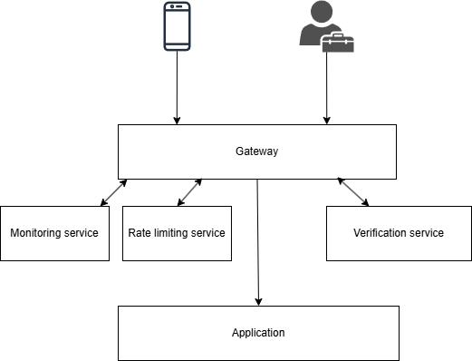
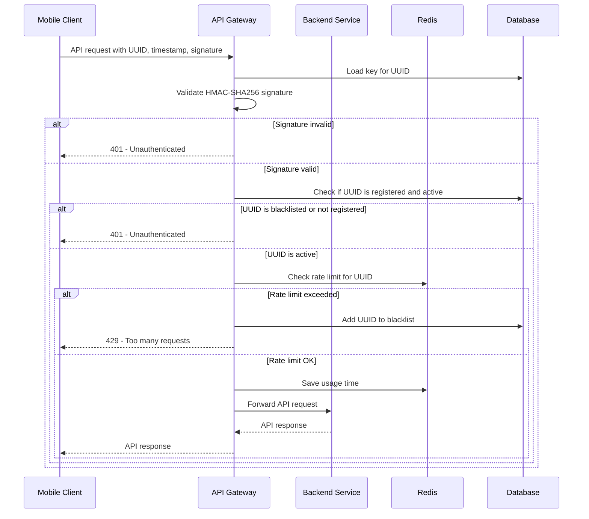

# Secure Programming Coursework
This is a project for the Secure Programming course at the University of Tampere. 

The goal of the coursework was to deepen the understanding in a selected field of secure programming.

I chose to study security features used in API gateways and implemented a simple API gateway 
by following secure coding practices. Gateway receives requests from mobile clients 
and forwards them to a backend service by first verifying security. The security features I decided to focus
on were verifying authenticity of the requests using HMAC, rate limiting, monitoring and security testing.
The project was implemented using Java and Spring Boot.

[](securityHighLevel.png)

## Parts of the project
- API Gateway: The main entry point for clients to access the backend service. It handles identifying clients, black listing, white listing, rate limiting, and monitoring.
- Backend Service: The service that the API Gateway communicates with. It handles the actual business logic and data processing. This is just a dummy service for testing purposes.
- Common Library: A shared library that contains common code used by both the API Gateway and the backend service. This includes utility functions, data models, and security-related code.
- Docker Compose: A configuration file for Docker Compose that defines the services, networks, and volumes used in the project. This allows for easy deployment and management of the services.
- Grafana and Prometheus: Monitoring tools used to visualize and analyze the state of the API Gateway and backend service. Grafana is used for creating dashboards and visualizations, while Prometheus is used for collecting and storing metrics.
- Postman: A tool used for testing and interacting with the API. It allows easy manual testing of endpoints, by sending requests, and viewing responses. Postman collection is included in the project.
- Unit Tests: A set of unit tests for the API Gateway and backend service. These tests cover various aspects of the code, including security and functionality. The tests are run using JUnit and Mockito.
- Integration Tests: A set of integration tests for the API Gateway and backend service. These tests cover the interaction between the two services, ensuring that they work together as expected. The tests are run using Spring Boot Test and Mockito.
- Security Testing: A set of security tests for the API Gateway. The tests are run using OWASP ZAP and CodeQL static application security testing.

## API Gateway and security features

### Overview
The API Gateway serves as the main entry point for client requests and is 
implemented using Spring Cloud Gateway. Routing to various endpoints is 
defined in GatewayConfig, with separate routes for mobile clients and 
administrative users.

### Sequence diagram of the client request flow



### Rate Limiting
Rate limiting is handled using Redis and Spring Cloud Gateway’s built-in support:

- Requests from mobile clients are rate-limited by their UUID.
- Administrative requests are rate-limited based on the client's IP address.
- If a mobile client exceeds the rate limit, its UUID is added to a blacklist, blocking further requests until an admin reactivates the client.

### Device Registration and Authentication
Mobile clients must register themselves using a POST request containing:

- A 16-character UUID.
- A base64-encoded 32-byte secret key.

#### Registration Process
1. Saves the UUID and encrypted key in the database (AES encryption is used).
2. Ensures the UUID is associated with a specific device.
3. Enables future request authentication using HMAC-SHA256.

#### Request Signature
Each request must include the following headers:

- `UUID`
- `timestamp`
- `signature`

The signature is calculated as:
HMAC_SHA256(UUID + ":" + timestamp, secret_key)

This guarantees:

- The request hasn't been tampered with.
- Only valid clients with the correct key can generate a matching signature.

#### Why HMAC-SHA256?
- It is stateless (no session required).
- It is widely supported.
- It provides strong tamper-proofing of requests.

### Monitoring and Logging
Security and usage metrics are collected and visualized using:

- **Micrometer** and **Prometheus** for metrics.
- **Grafana dashboard** for visualization.

Additionally:

- All requests and responses (excluding sensitive data) are logged.
- A custom `UsageTimeTrackingFilter` is used to:
  - Record request and response times.
  - Helps to detect requests made at unusual hours or patterns.

## How to run the project

### Clone the repository

### Install Docker and Docker Compose

### Add values to .env file, for example:
```
DB_HOST=db
DB_PORT=5432
DB_NAME=product-db
DB_USERNAME=myuser
DB_PASSWORD=mypassword
REDIS_PASSWORD=mypassword
REDIS_HOST=redis
REDIS_PORT=6379
ENCRYPTION_KEY=readFromBelow
GF_SECURITY_ADMIN_USER=admin
GF_SECURITY_ADMIN_PASSWORD=admin
```

Encryption key is used for AES encryption and decryption of the secret key. It should be a 32-byte base64 encoded string.
It can be generated using the following command:
```bash
openssl rand -base64 32
```

### Build the project
```bash
./gradlew build
```

### Run the project using Docker Compose
```bash
docker-compose up --build -d
```

## Using the application
There is a json file included in the project for Postman, which contains the endpoints and example requests. It can be imported into Postman for easy testing.

Grafana can be accessed at http://localhost:3000 and the default username and password are admin/admin. There is a dashboard configured that uses Prometheus as the data source.
One can and should also create alerts in grafana for unusual usage times, too many unauthenticated responses and too many requests responses.


## Quality control
There is a CI pipeline using Github workflows, that builds the program, runs unit tests and SAST. SAST analysis did not find
any issues at this state of the project.
Unit tests are focused on the security features of the API Gateway.

DAST was run locally and can be run using the following command:
```bash
docker pull zaproxy/zap-stable
docker run --network coursework_mynetwork -v ${PWD}:/zap/wrk/:rw -t zaproxy/zap-stable zap-api-scan.py `
>>   -f openapi -t /zap/wrk/openapi.yaml -r zap-report.html
```
For the purpose of the project results from the first run can be found as a PDF in the project. Obviously in the real world,
it would not be wise to publish report. Only 2 low risk issues were found.

Also results of the trivy misconfiguration scan can be found in the project. There are 2 issues to be fixed.
It was run using the following command:

```bash
docker pull aquasec/trivy:0.18.3 
docker run --rm -v "${PWD}:/project" aquasec/trivy config /project/ 
```

Project was done keeping security coding practices in mind as well as keeping the OWASP API Top 10 vulnerabilities as a checklist.

### OWASP API Top 10 checklist

The application logic was check against OWASP API Top 10 checklist:

-The application doesn't have any functionality where object-level authorization is needed.
If necessary in the future, there could be authenticated users who are the only ones allowed to
add products. Editing or removing products should include a verification step to ensure the request
is made by the same user who owns the product.

-The gateway provides public endpoints and identifies API clients using HMAC-signed requests and an
allowed device registry. UUIDs and client secrets are required to meet length requirements.
Client secrets are encrypted using AES before being stored in the database. While authentication is
out of scope for this project, client identification follows best practices. It is recommended to enforce
periodic secret rotation for clients.

-Returning only DTO objects is an effective way to prevent broken object property-level authorization
by including only non-sensitive fields in response objects.

-Rate limiting is implemented to mitigate denial-of-service attacks. Data models enforce maximum limits,
and only requests with valid input are processed. Invalid field names or additional fields in ProductDTO
objects result in exceptions.

-Currently, there is no authentication or authorization, but all admin endpoints are under the /admin/ path.
Filters can easily be added in GatewayConfig to secure these endpoints.

-Since the API is a dummy application for testing the gateway, there is no risk of violating business flows.
In a real-world application, sensitive flows could be protected using gateway filters and additional
application-side checks. The implemented device whitelisting and blacklisting in the gateway also enhance security.

-The application is not vulnerable to Server-Side Request Forgery (SSRF) in its current state. However,
if products were to include image URLs, appropriate security measures should be applied to validate
and sanitize these URLs.

-The software is designed to minimize exposure, but it is recommended to continuously review configurations.
A Trivy misconfiguration scan was performed, and the results are included in the repository to identify vulnerabilities.
In a real-world project, publishing such results would not be advisable.

-Before going into production, it is crucial to maintain up-to-date documentation. This should include
details about endpoints, request and response formats, and any authentication or authorization requirements.

-If the API used in the project were external, it would be necessary to validate and sanitize responses in GatewayConfig.

## Future improvements
Findings from the DAST and configuration scan should be fixed.
Admin endpoints should be secured with authentication and authorization.
Rate limiting for admin endpoints uses IP address, which is not very trustful. It would be better to use a more secure method, such as JWT tokens.
It would be wise to add dependency check for the libraries used in the project, to make sure that there are no known vulnerabilities in the libraries used.
Key rotation could be forced for the clients, so that they would have to change their keys periodically.

## AI Usage
The project was developed with the assistance of AI tools.

**AI tools used:**
- ChatGPT (GPT-4o)
- GitHub Copilot (Visual Studio Code extension, GPT-4o)


**Purpose of use and how they were used:**
- ChatGPT was used to brainstorm security features in the API Gateway, as well as to edit and improve documentation.
- GitHub Copilot was used for code autocompletion to speed up the implementation of standard boilerplate code in the Spring Boot project.

**Responsibility statement:**
I am aware that I am fully responsible for the entire content of this work, 
including the parts generated or assisted by AI tools, and I accept responsibility for any 
violations of academic integrity or ethical standards.